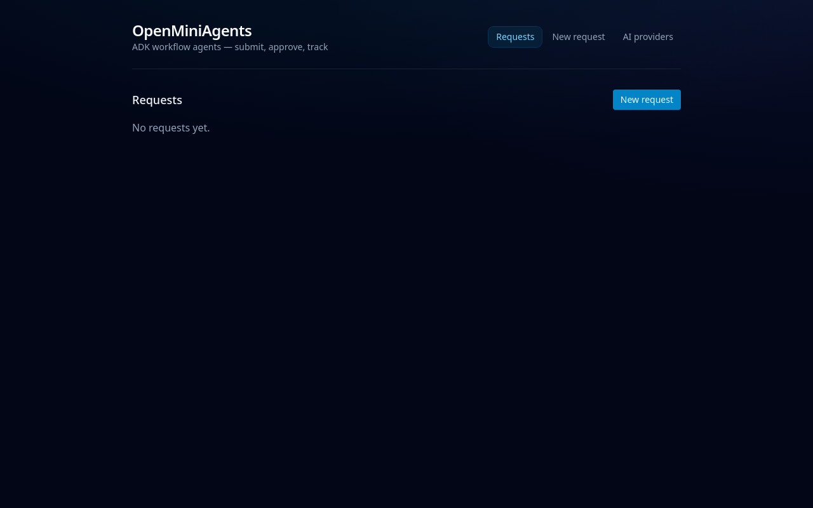
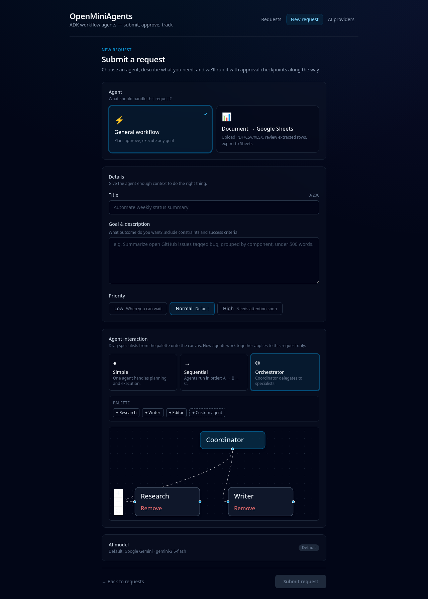
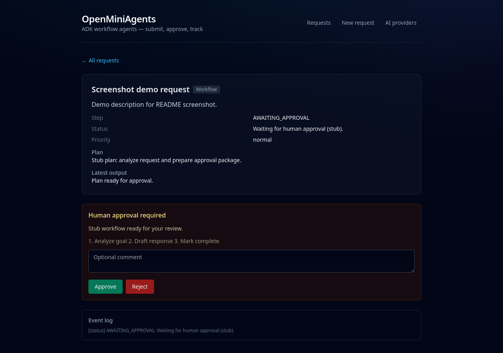
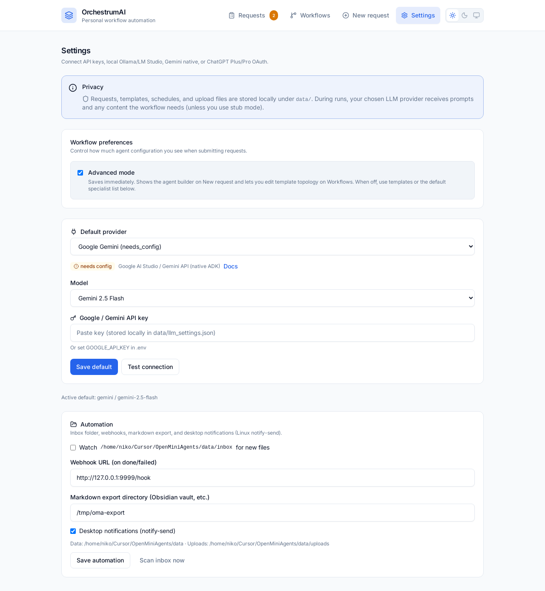

# OrchestrumAI

**Personal workflow automation** with approval-gated **Google ADK** agents, a **React** UI, saved templates, and cron schedules.

**Repository:** [github.com/dpastoetter/OrchestrumAI](https://github.com/dpastoetter/OrchestrumAI)  
**License:** [MIT](LICENSE) — Copyright (c) 2026 Dominik Pastoetter

Inspired by the [OpenClaw](https://openclaw.ai) ethos (your machine, your rules), but focused on **repeatable personal workflows** rather than an open-ended chat assistant.

---

## What it does

OrchestrumAI runs multi-step agents that **pause for your approval** before executing plans or writing to Google Sheets. You describe a goal, review the plan, then get a result you can copy, download as Markdown, or export via automation hooks.

| You want to… | Where to go |
|--------------|-------------|
| See what needs attention | **Requests** — filters (needs approval, running, done today, failed), badge count |
| Run or schedule saved routines | **Workflows** — pin templates, run with `{{variables}}`, cron schedules |
| One-off task with custom agents | **New request** — topology canvas (Advanced mode) |
| Connect LLMs and automation | **Settings** — providers, workflow defaults, inbox/webhooks |

---

## Screenshots

| Requests | Submit (topology builder) |
|----------|---------------------------|
|  |  |

| Request detail (approval) | Settings |
|---------------------------|----------|
|  |  |

Regenerate after UI changes (with `make dev-backend` and `make dev-frontend` running):

```bash
cd scripts && npm install && node capture-screenshots.mjs
```

---

## Features

### Core

- **Two agent types** — General workflow (plan → approve → execute) and Document → Google Sheets
- **Human-in-the-loop** — Approve or reject plans and row mappings in the UI
- **Multi-provider LLM** — Gemini (native ADK), OpenAI, Claude, OpenRouter, Ollama, LM Studio, ChatGPT OAuth
- **Stub mode** — Full UI without API keys (`ORCHESTRUMAI_STUB_RUN=1`)

### Workflows & scheduling

- **Saved templates** — Name, description template, topology, default priority; import/export JSON
- **Bundled starters** — Personal templates under `data/bundled_templates/` (imported once per data dir)
- **Template variables** — `{{date}}`, `{{week}}`, `{{datetime}}`, `{{month}}`, `{{year}}`, plus custom vars on run
- **Cron schedules** — Daily/weekday presets; **pause for approval** or **auto-run** (`skip_plan`) per schedule
- **Per-template history** — Last run time and status on the Workflows page

### Agent builder (Advanced mode)

Enable in **Settings → Advanced mode** (saved immediately):

- **New request** — React Flow canvas: Simple, Sequential, or Orchestrator + specialist palette
- **Workflows** — **Edit agents** on a template to change topology in place
- When Advanced mode is off, use templates or **Settings → Default specialists** for simple runs

### Private documents

Upload PDF, CSV, XLSX, or text on workflow submits (stored under `data/uploads/`). Specialists read local excerpts; relevant text may be sent to your LLM during the run.

| Specialist | Role |
|------------|------|
| Text Extractor | Read text from local PDF / txt / md |
| Table Peek | Preview tables without Sheets export |
| PII Redactor | Mask emails, phones, addresses |
| Invoice Parser | Vendor, line items, totals |
| Clause Finder | Termination, payment, liability, confidentiality |
| Grep Doc | Keyword search across document text |
| Doc Profile | File type, size, OCR risk, previews |

Plus **Research** (web), **Writer**, **Editor**, and **custom agents** with your own instructions.

### Productivity UI

- **Requests inbox** — Filter chips, awaiting-first sort, optional browser notifications
- **Result actions** — Copy plan/result, download request as `.md`, open sheet link when present
- **Delete requests** — Remove old runs from the list
- **Light / dark theme**

### Automation (Settings)

| Option | Behavior |
|--------|----------|
| **Inbox watch** | Drop files in `data/inbox/` → auto-create workflow requests (periodic scan) |
| **Webhook URL** | POST on request done/failed (local n8n, Home Assistant, etc.) |
| **Markdown export dir** | Save completed results with frontmatter (e.g. Obsidian vault) |
| **Desktop notify** | `notify-send` when a run needs approval (Linux) |

---

## Privacy & data

| Stays on your machine | Sent to your LLM provider (when not in stub mode) |
|-----------------------|---------------------------------------------------|
| Request index, templates, schedules, settings | Prompts built from your title, description, and plan |
| Upload file copies under `data/uploads/` | Document excerpts and tool outputs the workflow needs |
| API keys in `data/llm_settings.json` | — |
| ChatGPT OAuth tokens in `data/chatgpt_oauth.json` | — |

Nothing is hosted for you: run the backend locally (or your own VPS). Pick providers you trust; use Ollama/LM Studio to keep inference on localhost.

Legacy env names (`OPENMINIAGENTS_*`) still work as fallbacks in `orchestrumai.config`.

---

## Architecture

```
agents/
  workflow_agent/              # Plan → approve → execute state machine
    generic_agents/            # Specialist catalog + tools
    topology_builder.py        # Builds ADK agent graph from canvas JSON
  doc_to_sheets_agent/         # Parse → preview → Sheets append

backend/orchestrumai/          # FastAPI, SQLite stores, ADK runner bridge
frontend/                      # React + Vite + React Flow
data/                          # SQLite DBs, settings, uploads, inbox, bundled_templates/
scripts/orchestrum.py          # Thin REST CLI
```

- **ADK sessions:** `data/sessions.db` (`DatabaseSessionService`)
- **App data:** `data/requests.db` — requests, `workflow_templates`, `workflow_schedules`
- **Runner cache:** Invalidated when provider, model, topology, or default specialists change

### Topology modes (General workflow)

| Mode | Behavior |
|------|----------|
| **Simple** | One root agent handles planning and execution |
| **Sequential** | Pipeline: specialists run in order (A → B → C) |
| **Orchestrator** | Coordinator delegates to specialists via AgentTool |

Request detail shows topology mode and agent names as chips.

---

## Requirements

- Python 3.11+
- Node.js 18+
- One LLM credential, **or** stub mode, **or** local Ollama/LM Studio
- [Gemini API key](https://aistudio.google.com/apikey) recommended for PDF/image extraction
- Google Cloud **service account** + Sheets API optional for real Doc → Sheets writes

---

## Quick start

```bash
git clone https://github.com/dpastoetter/OrchestrumAI.git
cd OrchestrumAI
pip install -e ".[dev]"
cd frontend && npm install
cp .env.example .env
```

**Terminal 1 — API** (stub: no external LLM calls):

```bash
export ORCHESTRUMAI_STUB_RUN=1
make dev-backend
```

**Terminal 2 — UI:**

```bash
make dev-frontend
```

Open [http://localhost:5173](http://localhost:5173).

1. **Workflows** — Run a bundled template (e.g. morning brief) → approve the plan → read the result.
2. **Settings** — Turn on **Advanced mode** → **New request** → build a topology on the canvas.
3. **Doc → Sheets** — Upload a file → preview rows → approve write.

Verify the backend: `curl -s http://127.0.0.1:8000/api/health` should list `features` including `automation` and `workflow-templates`.

### Live runs

```bash
unset ORCHESTRUMAI_STUB_RUN
export GOOGLE_API_KEY=your-key
# Optional Sheets:
export GOOGLE_APPLICATION_CREDENTIALS=/path/to/service-account.json
export DEFAULT_SPREADSHEET_ID=your-spreadsheet-id
make dev-backend
```

Install optional LLM extras:

```bash
pip install 'orchestrumai[llm]'   # LiteLLM + Codex OAuth for ChatGPT connect
```

---

## AI providers

Configure in **Settings** (`/settings`). Defaults persist in `data/llm_settings.json`.

| Provider | Auth | Notes |
|----------|------|--------|
| Google Gemini | `GOOGLE_API_KEY` | Native ADK (default) |
| OpenAI | API key | LiteLLM |
| Anthropic Claude | API key | LiteLLM |
| OpenRouter | API key | LiteLLM |
| Ollama | Host URL | No key |
| LM Studio | OpenAI-compatible base URL | No key |
| ChatGPT Plus/Pro | OAuth in UI | Tokens in `data/chatgpt_oauth.json` |

Per-request provider/model override on **New request**. If provider dropdowns are empty, restart the backend so `/api/providers` is registered.

---

## Always-on backend (schedules & inbox)

Cron and inbox scanning run inside the FastAPI process. For overnight automation, use a user systemd unit (Linux):

```ini
# ~/.config/systemd/user/orchestrumai.service
[Unit]
Description=OrchestrumAI personal workflow runner
After=network.target

[Service]
Type=simple
WorkingDirectory=/path/to/OrchestrumAI
EnvironmentFile=/path/to/OrchestrumAI/.env
ExecStart=/usr/bin/python3 -m uvicorn orchestrumai.app:create_app --factory --host 127.0.0.1 --port 8000
Restart=always
RestartSec=5

[Install]
WantedBy=default.target
```

```bash
systemctl --user daemon-reload
systemctl --user enable --now orchestrumai.service
```

Keep using Vite in dev (`make dev-frontend`), or build and serve the UI from the API:

```bash
make build-frontend
# Backend serves frontend/dist when present — open http://127.0.0.1:8000/
```

---

## CLI

```bash
export ORCHESTRUMAI_API=http://127.0.0.1:8000/api   # optional

python3 scripts/orchestrum.py health
python3 scripts/orchestrum.py list
python3 scripts/orchestrum.py run <template-id> --title "Monday brief" --var topic=standup
python3 scripts/orchestrum.py submit --title "Summarize inbox" --description "..."
```

---

## Environment variables

| Variable | Default | Purpose |
|----------|---------|---------|
| `ORCHESTRUMAI_DATA_DIR` | `./data` | SQLite, uploads, settings |
| `ORCHESTRUMAI_HOST` | `127.0.0.1` | Bind address |
| `ORCHESTRUMAI_PORT` | `8000` | Bind port |
| `ORCHESTRUMAI_STUB_RUN` | off | `1` = simulated agents |
| `ORCHESTRUMAI_DEFAULT_USER_ID` | `local-user` | Multi-user header default |
| `ORCHESTRUMAI_API` | `http://127.0.0.1:8000/api` | CLI base URL |
| `GOOGLE_API_KEY` | — | Gemini |
| `GOOGLE_APPLICATION_CREDENTIALS` | — | Sheets service account JSON |
| `DEFAULT_SPREADSHEET_ID` | — | Default sheet for Doc → Sheets |
| `OLLAMA_HOST` | `http://127.0.0.1:11434` | Local Ollama |
| `LM_STUDIO_BASE_URL` | `http://127.0.0.1:1234/v1` | LM Studio |

See `.env.example` for a starter file.

---

## API reference

Base path: `/api`. Optional header: `X-User-Id` (defaults to `local-user`).

### Requests & agents

| Method | Path | Description |
|--------|------|-------------|
| GET | `/health` | Status + `features` list |
| GET | `/agents` | Available agent types |
| POST | `/requests` | Submit workflow (JSON; optional `agent_topology`) |
| POST | `/requests/upload` | Multipart Doc → Sheets |
| GET | `/requests` | List requests |
| GET | `/requests/{id}` | Detail, preview rows, topology summary |
| DELETE | `/requests/{id}` | Delete request and related files |
| POST | `/requests/{id}/resume` | `{ "decision": "approved" \| "rejected", "comment": "" }` |
| GET | `/requests/{id}/events` | SSE progress stream |
| POST | `/requests/{id}/save-as-template` | Save completed workflow as template |

### Providers

| Method | Path | Description |
|--------|------|-------------|
| GET | `/providers` | Catalog + saved settings |
| PUT | `/providers/settings` | Default provider, keys, Ollama/LM Studio URLs |
| POST | `/providers/test` | Connectivity check |
| GET/POST | `/providers/chatgpt-oauth/*` | Connect / status / callback / disconnect |

### Workflow settings & catalog

| Method | Path | Description |
|--------|------|-------------|
| GET | `/workflow/generic-agents` | Specialist palette metadata |
| GET/PUT | `/workflow/settings` | `enabled_generic_agents`, `advanced_mode` |

### Templates & schedules

| Method | Path | Description |
|--------|------|-------------|
| GET/POST/PUT/DELETE | `/workflow-templates` | Template CRUD |
| POST | `/workflow-templates/{id}/run` | Start request (`description_vars`, optional `title`) |
| GET | `/workflow-templates/{id}/export` | Download template JSON |
| POST | `/workflow-templates/import` | Import template JSON |
| GET/POST/PUT/DELETE | `/workflow-schedules` | Cron (`on_approval`: `pause` \| `skip_plan`) |
| POST | `/workflow-schedules/{id}/trigger` | Run now |

### Automation

| Method | Path | Description |
|--------|------|-------------|
| GET/PUT | `/automation/settings` | Inbox watch, webhook, export dir, desktop notify |
| POST | `/automation/scan-inbox` | Scan `data/inbox/` immediately |

### `agent_topology` (workflow body)

```json
{
  "type": "orchestrator",
  "nodes": [
    { "id": "n1", "kind": "catalog", "catalog_id": "research" },
    { "id": "n2", "kind": "custom", "name": "Reviewer", "instruction": "Check facts and tone." }
  ],
  "edges": []
}
```

Types: `simple` | `sequential` | `orchestrator`. Sequential topologies use edges `{ "from": "n1", "to": "n2" }`; the UI auto-chains when you reorder nodes.

---

## Development

```bash
make install      # pip -e ".[dev]" + npm install
make test         # pytest (stub mode)
make build-frontend
```

`make dev-backend` runs uvicorn with `--reload` on `backend/` and `agents/`.

### Project layout

| Path | Role |
|------|------|
| `backend/orchestrumai/` | FastAPI app, stores, scheduler, inbox watcher |
| `backend/tests/` | API, topology, agents, automation tests |
| `agents/workflow_agent/` | ADK workflow + generic specialists |
| `agents/doc_to_sheets_agent/` | Extraction and Sheets tools |
| `frontend/src/` | React views, topology canvas, contexts |
| `data/` | Runtime data (gitignored except bundled template seeds) |

---

## Rename from OpenMiniAgents

If you used the previous name:

- Python package: `openminiagents` → `orchestrumai`
- Env vars: `OPENMINIAGENTS_*` → `ORCHESTRUMAI_*` (legacy names still read)
- CLI: `scripts/oma.py` → `scripts/orchestrum.py`
- Re-run: `pip install -e ".[dev]"` and restart the backend

---

## Further reading

- [ADK Python](https://google.github.io/adk-docs/)
- [Long-running agents with ADK](https://developers.googleblog.com/build-long-running-ai-agents-that-pause-resume-and-never-lose-context-with-adk/)

## Author

Dominik Pastoetter — [github.com/dpastoetter](https://github.com/dpastoetter)
